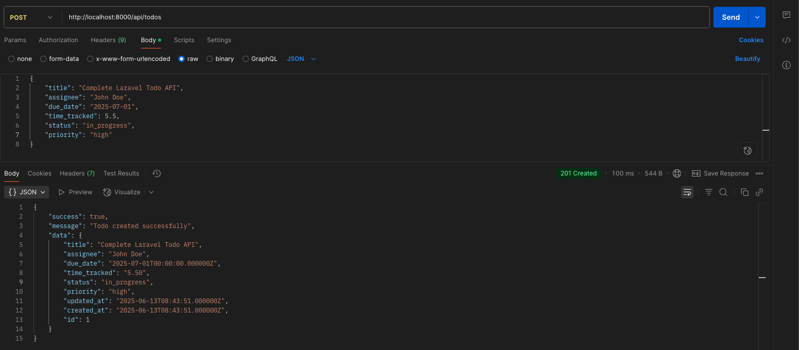
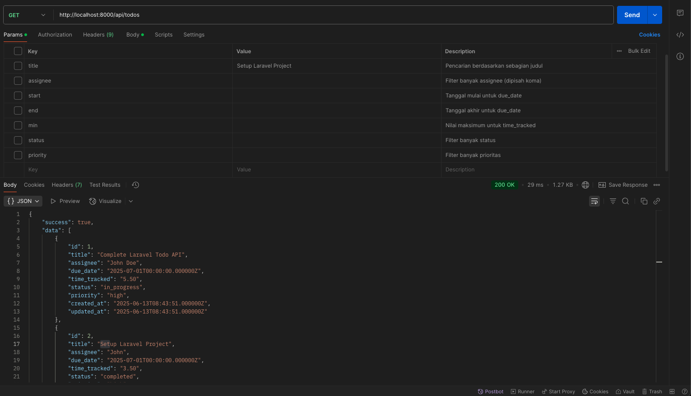
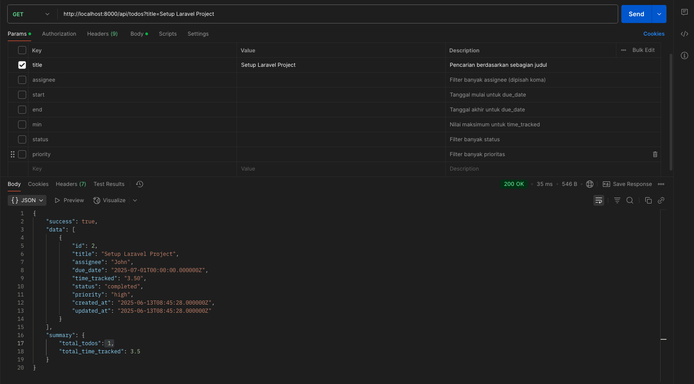
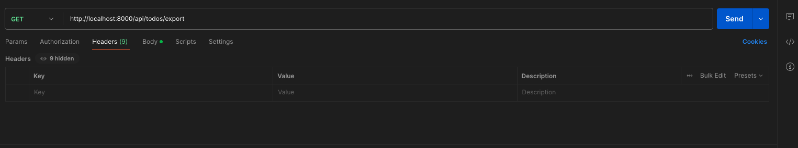
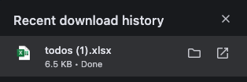
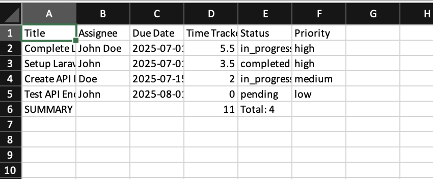
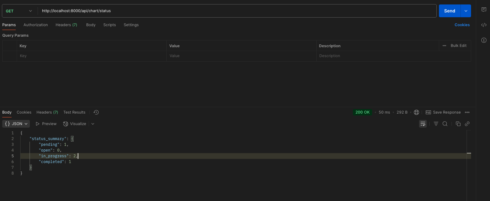
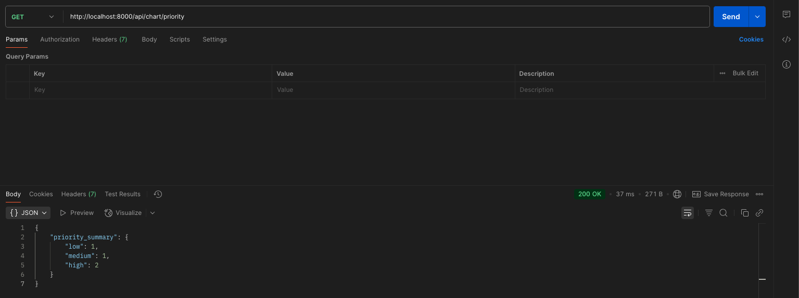
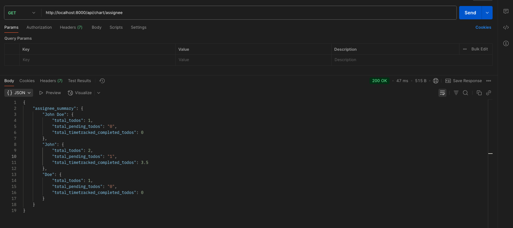

# Laravel Todo API - Test Results

## 📋 Project Overview
Laravel REST API untuk Todo List dengan fitur CRUD, filtering, export Excel, dan chart data.

## 🚀 Installation & Setup

```bash
# Clone repository
git clone https://github.com/username/laravel-todo-api.git
cd laravel-todo-api

# Install dependencies
composer install

# Copy environment file
cp .env.example .env

# Generate app key
php artisan key:generate

# Setup database
php artisan migrate
php artisan db:seed --class=TodoSeeder

# Run server
php artisan serve
```

## 📊 API Testing Results

### 1. API Create Todo (POST /api/todos)



---

### 2. API Get Todo List (GET /api/todos)


---

### 3. API Get Todo List with Filtering



---

### 4. API Export Excel (GET /api/todos/export)


**Request:**


**Excel Download**


**Excel File**


```
Untuk Download Excel Url endpoint harus diakses di web browser agar terdownload
```

---

### 5. API Chart Data - Status Summary (GET /api/chart/status)


---

### 6. API Chart Data - Priority Summary (GET /api/chart/priority)



---

### 7. API Chart Data - Assignee Summary (GET /api/chart/assignee)




## 🛠️ API Endpoints

| Method | Endpoint | Description |
|--------|----------|-------------|
| POST | `/api/todos` | Create new todo |
| GET | `/api/todos` | Get all todos with filtering |
| GET | `/api/todos/export` | Export todos to Excel |
| GET | `/api/chart/status` | Get status summary for charts |
| GET | `/api/chart/priority` | Get priority summary for charts |
| GET | `/api/chart/assignee` | Get assignee summary for charts |

## ✅ Test Requirements Completed

- [x] **Requirement 1:** API Create Todo List with validation
- [x] **Requirement 2:** API Get Todo List with filtering and Excel export
- [x] **Requirement 3:** API Get Todo List for Chart Data (status, priority, assignee)

## 📧 Submission

Repository: https://github.com/narantyomaulana/backend-dev-test-talenta
Demo: All API endpoints tested successfully via Postman  
Screenshots: Available in `/screenshots` folder and embedded in this README

---

**Developed by:** Narantyo Maulana Adhi Nugraha
**Date:** June 13, 2025  
**Framework:** Laravel 12.x
